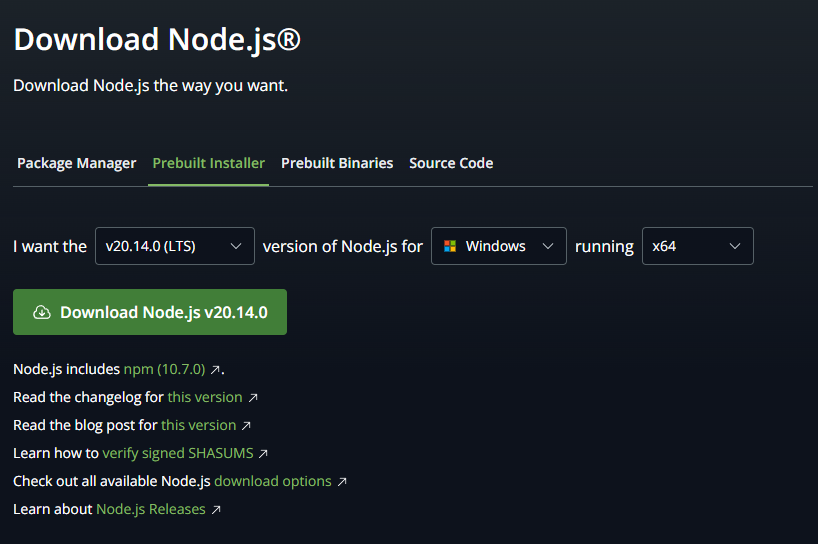
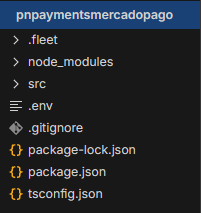
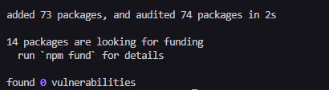
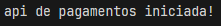

# Documentação PNPAYMENTS - mercadopago API  v0.0.5

# Guia de instalação

Para iniciar o processo de instalação você deve ter instalado no seu computador ou servidor o **Nodejs 20.14**

## Instalar Nodejs no windows

### Download Nodejs

link para download: [https://nodejs.org/en/download/prebuilt-installer](https://nodejs.org/en/download/prebuilt-installer)

- Escolha a versão 20.14 do Nodejs
- Escolha seu sistema operacional
- Escolha a versão do seu sistema
- Clique em **Download Node.js v20.14.**



## Instalar Nodejs no Linux

Baseados em Debian/Ubuntu

no terminal

```bash
curl -o- https://raw.githubusercontent.com/nvm-sh/nvm/v0.39.7/install.sh | bash
nvm install 20
```

Feche o terminal caso esteja usando linux no modo interface(**Desktop**), caso esteja usando somente no modo terminal(**server**) reinicie a maquina.

Agora teste se a instalação deu certo.

```bash
node -v # should print `v20.14.0` 
```

## Instalar Dependências

Para instalar as dependências do projeto abra o seu terminal na pasta raiz da api    



No terminal digite

```bash
npm install
```

se ocorrer tudo bem 



## Configurando Variáveis de Ambiente

crie um arquivo na raiz do protejo chamando **.env** dentro do arquivo coloque a seguinte configuração.

```
API_PORT = "4700"
```

Essa e a configuração da porta da API, escolha uma porta que não esteja em uso e que não corra o risco de nenhuma outra aplicação usar pois pode ocorrer o risco da API desligar nesse processo ou na próxima vez que ela for iniciada ocorra algum erro.

Após essa configuração a API está pronta para ser inicializada

## Inicializando a API

Para inicializar a API digite o seguinte comando no terminal 

```bash
npm run start
```

se ocorrer tudo bem



# Pagamentos


## Criar pagamento

Para criar um pagamento use a rota ( **/payment/create/** )

método **POST**

Exemplo do pedido do pagamento 

```json
{
  "requestPaymentData":{
    "paymentId":"id do pagamento",
    "paymentDescription":"pagamento via mercado pago",
    "paymentValue":80,
    "paymentAccessToken":"accesstoken - mercadopago",
    "paymentInstallments":1,
    "paymentMethodId":"pix or master or visa",
    "paymentToken":"credit card token",
   	"paymentIssuerId":"credit card IssuerId"
  },
  "requestPayerData":{
   "paymentPayerEmail":"teste@teste.com",
   "paymentPayerIndentificationType":"CPF | CNPJ",
   "paymentPayerIndentificationNumber":"12345678909"
  }
}
```
Exemplo de retorno **Success**

```json
{
    "code": 203,
    "message": "pagamento criado com sucesso",
    "payment": {}
}
```

Exemplo de retorno **Error**

```json
{
  "code": 400,
  "message": "não foi possivel criar seu pagamento",
  "payment": null
}
```

## Checar pagamento

Para checar um pagamento use a rota ( **/payment/check/status/** )

método **POST**

Exemplo de checagem de pagamento

```json
{
  "requestPaymentId":"0000000000",
  "requestPaymentAccessToken":"seu access token (credencial de produção)"
}
```

Exemplo de retorno **Success**

```json
{
  "code": 200,
  "message": "pagamento checado com sucesso",
  "payment": {
    "paymentStatus": "approved",
    "paymentStatusDetail": "accredited",
    "paymentStatusType": "credit_card",
    "paymentStatusMethod": "master",
    "paymentStatusApprovedDate": "2024-07-01T13:55:02.793-04:00"
  }
}
```

Exemplo de retorno **Error**

```json
{
  "code": 404,
  "message": "não foi possivel checar seu pagamento",
  "payment": null
}
```


## Cancelar Pagamento

Para cancelar um pagamento use a rota ( **/payment/cancel/** )

método **POST**

Exemplo de cancelamento do pagamento

```json
{
  "requestPaymentId":"0000000000",
  "requestPaymentAccessToken":"seu access token (credencial de produção)"
}
```

Exemplo de retorno **Success**

```json
{
  "code": 200,
  "message": "pagamento cancelado com sucesso",
  "payment": {
    "paymentStatus": "cancelled",
    "paymentStatusDetail": "by_collector",
    "paymentStatusType": "bank_transfer",
    "paymentStatusMethod": "pix",
    "paymentStatusApprovedDate": null
  }
}
```

Exemplo de retorno **Error**

```json
{
  "code": 404,
  "message": "não foi possivel cancelar seu pagamento",
  "payment": null
}
```
## Reembolsar Pagamento

Para reembolsar um pagamento use a rota ( **/payment/refund/** )

método **POST**

Exemplo de reembolso do pagamento

```json
{
  "requestPaymentId":"0000000000",
  "requestPaymentAccessToken":"seu access token (credencial de produção)",
  "requestPaymentValue":0
}
```

Exemplo de retorno **Success**

```json
{
  "code": 203,
  "message": "pagamento reembolsado com sucesso!",
  "payment": null
}
```

Exemplo de retorno **Error**

```json
{
  "code": 404,
  "message": "não foi possivel reembolsar seu pagamento",
  "payment": null
}
```
